# ☁️ Guía Completa AWS Certified Cloud Practitioner (CLF-C02)

> 📌 **Documento de estudio autosuficiente** — Cubre los 4 dominios del examen con explicaciones, ejemplos y mnemotecnia.

---

## 📋 Información del Examen

| Dato | Detalle |
|------|---------|
| **Duración** | 90 minutos |
| **Preguntas** | 65 (solo 50 puntúan) |
| **Aprobado** | ~700/1000 puntos |
| **Precio** | 100 USD |
| **Idioma** | Recomendable español (puedes ver el original en inglés) |
| **Formato** | Opción múltiple (1 correcta) + Respuesta múltiple (2+ correctas) |

### Dominios del Examen

| Dominio | Peso |
|---------|------|
| 1. Conceptos de la nube | 24% |
| 2. Seguridad y conformidad | 30% |
| 3. Tecnología y servicios en la nube | 34% |
| 4. Facturación, precios y soporte | 12% |

---

# 🌥️ DOMINIO 1: Conceptos de la Nube (24%)

## 1.1 ¿Qué es la Computación en la Nube?

La computación en la nube es la **entrega de recursos tecnológicos bajo demanda a través de internet con pago por uso**. En lugar de comprar y mantener tus propios servidores, "alquilas" los recursos que necesitas cuando los necesitas.

### Analogía simple
> Imagina que en vez de comprar un coche (servidor propio), usas un taxi o Uber (nube). No tienes que preocuparte del mantenimiento, combustible ni seguro. Solo pagas por los kilómetros que usas.

### Definición oficial AWS (las 5 características esenciales del NIST)

1. **Autoservicio bajo demanda**: El usuario puede aprovisionar recursos sin interacción humana con el proveedor.
2. **Acceso amplio a la red**: Disponible a través de internet desde cualquier dispositivo.
3. **Pool de recursos compartidos**: Los recursos físicos se comparten entre múltiples clientes (multi-tenant).
4. **Elasticidad rápida**: Los recursos se pueden escalar hacia arriba o abajo de forma rápida o automática.
5. **Servicio medido**: Pagas exactamente por lo que usas (como el agua o la electricidad).

---

## 1.2 Modelos de Despliegue de la Nube

Existen 3 formas de usar la nube:

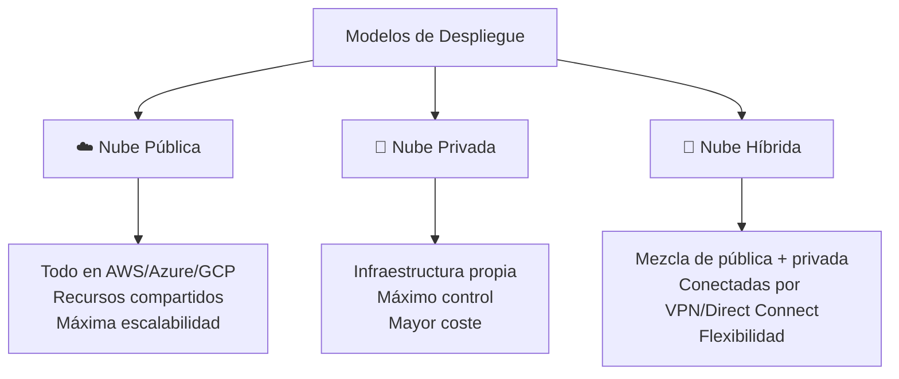

| Modelo | Descripción | Cuándo usarlo |
|--------|-------------|---------------|
| **Pública** | AWS gestiona todo. Recursos compartidos entre clientes. | Startups, cargas variables, nuevas apps |
| **Privada** | Tu propio CPD (data center). Control total. | Sector bancario, datos muy sensibles |
| **Híbrida** | Combinas tu infraestructura con la nube pública. | Migración gradual, requisitos regulatorios |

> 🧠 **Mnemotecnia**: **P**ública = **P**ropiedad de AWS · **P**rivada = **P**ropiedad tuya · **H**íbrida = **H**ybrid = ambas

---

## 1.3 Modelos de Servicio en la Nube

Define **cuánto gestiona AWS** vs **cuánto gestionas tú**:

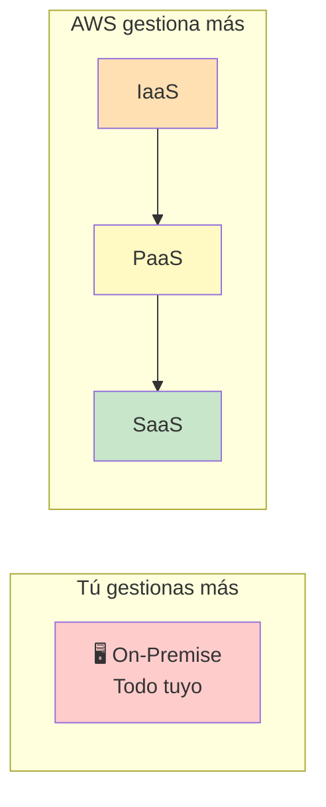

### IaaS — Infrastructure as a Service
- AWS te da la **infraestructura básica** (servidores, redes, almacenamiento).
- Tú gestionas: SO, middleware, aplicaciones, datos.
- **Ejemplo AWS**: EC2 (máquinas virtuales), S3 (almacenamiento).
- **Analogía**: Alquilas el terreno y el edificio vacío. Tú pones los muebles y decoras.

### PaaS — Platform as a Service
- AWS gestiona la infraestructura **y** el sistema operativo/plataforma.
- Tú solo te preocupas del **código y los datos**.
- **Ejemplo AWS**: Elastic Beanstalk, RDS (base de datos gestionada).
- **Analogía**: Alquilas un piso ya amueblado. Solo traes tu ropa.

### SaaS — Software as a Service
- **Todo gestionado** por el proveedor. Solo usas la aplicación.
- Tú gestionas: solo los datos que introduces.
- **Ejemplo AWS**: Amazon WorkMail, Chime. Ejemplos fuera de AWS: Gmail, Salesforce.
- **Analogía**: Alquilas una habitación de hotel. Todo incluido.

> 🧠 **Mnemotecnia**: **I**nfra · **P**lataforma · **S**oftware = **IPS** (como una dirección IP, de abajo a arriba)

---

## 1.4 Ventajas de la Nube AWS (los 6 pilares clásicos)

AWS define 6 ventajas fundamentales de migrar a la nube. **Estas suelen aparecer en el examen.**

### 1. Cambiar gastos de capital (CapEx) por gastos variables (OpEx)
- **CapEx (Capital Expenditure)**: Compras un servidor por 50.000€. Lo pagas todo de una vez.
- **OpEx (Operational Expenditure)**: Pagas 500€/mes por usar los recursos en la nube.
- **Ventaja**: No necesitas invertir dinero antes de saber si tu negocio funcionará.

> **Ejemplo real**: Un startup no tiene que pedir un crédito para comprar servidores. Empieza pagando lo mínimo y crece con su negocio.

### 2. Beneficiarse de economías de escala masivas
- AWS compra millones de servidores → precios de hardware mucho más bajos que cualquier empresa.
- Esos ahorros se transfieren a ti en forma de precios más bajos.

### 3. No tener que adivinar la capacidad
- **Problema tradicional**: ¿Cuántos servidores necesito? Si compro pocos, el sistema cae. Si compro demasiados, malgasto dinero.
- **Solución en nube**: Escalas automáticamente según la demanda real (Auto Scaling).

### 4. Aumentar velocidad y agilidad
- Antes: Comprar, instalar y configurar servidores podía tardar semanas o meses.
- En AWS: En minutos tienes una máquina virtual funcionando.

### 5. No gastar dinero en gestionar data centers
- Sin preocuparse por: electricidad, refrigeración, seguridad física, sustitución de hardware.
- AWS se encarga de todo eso.

### 6. Tener alcance global en minutos
- AWS tiene regiones en todo el mundo.
- Puedes desplegar tu aplicación cerca de tus usuarios en Asia, Europa o América con pocos clics.

---

## 1.5 El Well-Architected Framework (Marco de Buenas Prácticas)

AWS define **6 pilares** para construir sistemas bien diseñados en la nube. Esto es muy importante para el examen.

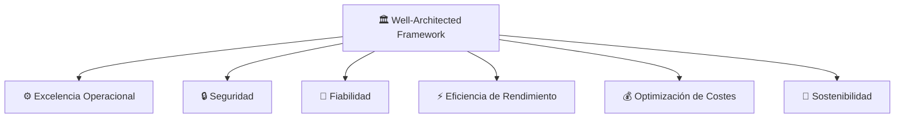

| Pilar | ¿Qué significa? | Ejemplo |
|-------|-----------------|---------|
| **Excelencia Operacional** | Ejecutar y monitorizar sistemas, mejorar procesos continuamente | Automatizar despliegues, usar CloudWatch |
| **Seguridad** | Proteger información y sistemas | IAM, cifrado, MFA |
| **Fiabilidad** | Sistema funciona correctamente y se recupera de fallos | Multi-AZ, backups automáticos |
| **Eficiencia de Rendimiento** | Usar recursos eficientemente para cumplir requisitos | Elegir el tipo correcto de EC2 |
| **Optimización de Costes** | Evitar gastos innecesarios | Reserved Instances, eliminar recursos sin uso |
| **Sostenibilidad** | Minimizar impacto medioambiental | Usar instancias eficientes, reducir huella de carbono |

> 🧠 **Mnemotecnia**: **O**peraciones · **S**eguridad · **F**iabilidad · **R**endimiento · **C**ostes · **S**ostenibilidad = **OS FRCS** (como "OS forces" — las fuerzas que guían tu arquitectura)

---

## 1.6 Infraestructura Global de AWS

Entender cómo está distribuida físicamente AWS es fundamental.

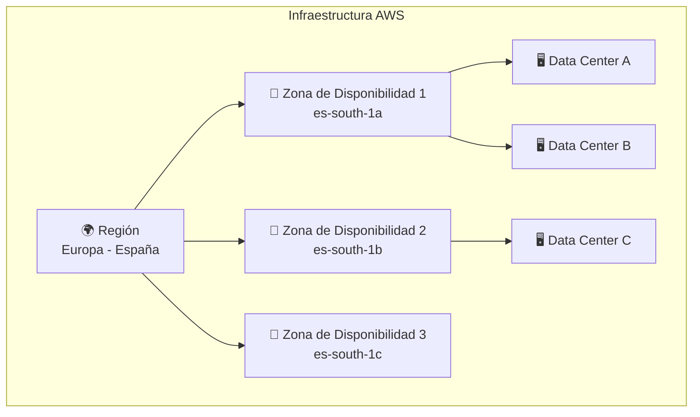

### Región (Region)
- Una **región** es una ubicación geográfica donde AWS tiene infraestructura (ej: `eu-south-2` = España, `us-east-1` = Virginia).
- AWS tiene más de **30 regiones** en el mundo.
- **Cada región es independiente** — los datos no salen de la región salvo que tú lo configures.
- **¿Cómo elegir una región?**
  1. **Cumplimiento legal**: ¿Los datos deben estar en la UE? → Elige región europea
  2. **Latencia**: ¿Dónde están tus usuarios? → Elige región más cercana
  3. **Disponibilidad de servicios**: No todos los servicios están en todas las regiones
  4. **Precio**: Los precios varían por región

### Zona de Disponibilidad (Availability Zone - AZ)
- Dentro de cada región hay entre **2 y 6 AZs** (normalmente 3).
- Cada AZ es **uno o más data centers físicamente separados** dentro de la misma región.
- Separadas por decenas de km → si hay inundación/incendio en una, las otras siguen funcionando.
- Conectadas con **redes de fibra de muy baja latencia**.
- Si despliegas en múltiples AZs → **Alta Disponibilidad (High Availability)**.

> **Ejemplo**: Tu app en `eu-west-1a` y `eu-west-1b`. Si el CPD A falla, el B sigue respondiendo.

### Zonas Locales (Local Zones)
- Extensiones de una región que llevan servicios AWS **más cerca de grandes ciudades**.
- Para apps que necesitan latencia ultra-baja (gaming, streaming, AR/VR).
- Ejemplo: AWS Local Zone en Madrid.

### Puntos de Presencia / Edge Locations
- AWS tiene más de **400+ puntos de presencia** en todo el mundo.
- Los usa **CloudFront (CDN)** para servir contenido desde el servidor más cercano al usuario.
- No ejecutan tus aplicaciones, sino que **cachean** el contenido.

> 🧠 **Para recordar la jerarquía**: **R**egión > **Z**ona de Disponibilidad > **D**ata Center = **RZD** (como los trenes de alta velocidad, rápidos y distribuidos)

---

## 1.7 Responsabilidad Compartida (Shared Responsibility Model)

Este es uno de los conceptos **más importantes del examen**. Define qué es responsabilidad de AWS y qué es tuya.

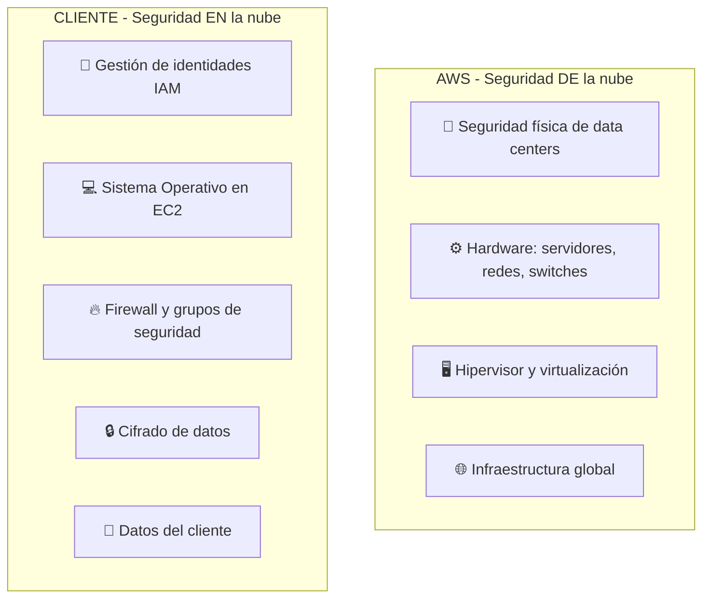

### Regla de oro
> **AWS** es responsable de la seguridad **DE** la nube (hardware, instalaciones físicas, red global).
> **TÚ** eres responsable de la seguridad **EN** la nube (lo que despliegas y configuras).

### ¿Cómo varía según el servicio?

| Tipo de servicio | AWS gestiona | Tú gestionas |
|------------------|--------------|--------------|
| **EC2 (IaaS)** | Hardware, hipervisor | SO, parches, datos, firewall |
| **RDS (PaaS)** | Hardware, SO, motor de BD | Datos, usuarios de BD, cifrado |
| **Lambda (Serverless)** | Todo excepto el código | Solo el código y los datos |

> **Ejemplo práctico**: Si instalas EC2 con Linux y no actualizas el kernel → **es tu responsabilidad**. AWS no te parchea el SO. Pero si hay un fallo físico en el servidor → **es responsabilidad de AWS**.

> 🧠 **Regla**: Si es **físico o de infraestructura** → AWS. Si es **lógico o de configuración** → Tú.


---

# 🔒 DOMINIO 2: Seguridad y Conformidad (30%)

> Este es el dominio con mayor peso en el examen. Domina IAM y los servicios de seguridad.

## 2.1 IAM — Identity and Access Management

IAM es el servicio que controla **quién puede hacer qué en AWS**. Es la base de toda la seguridad.

### Componentes de IAM

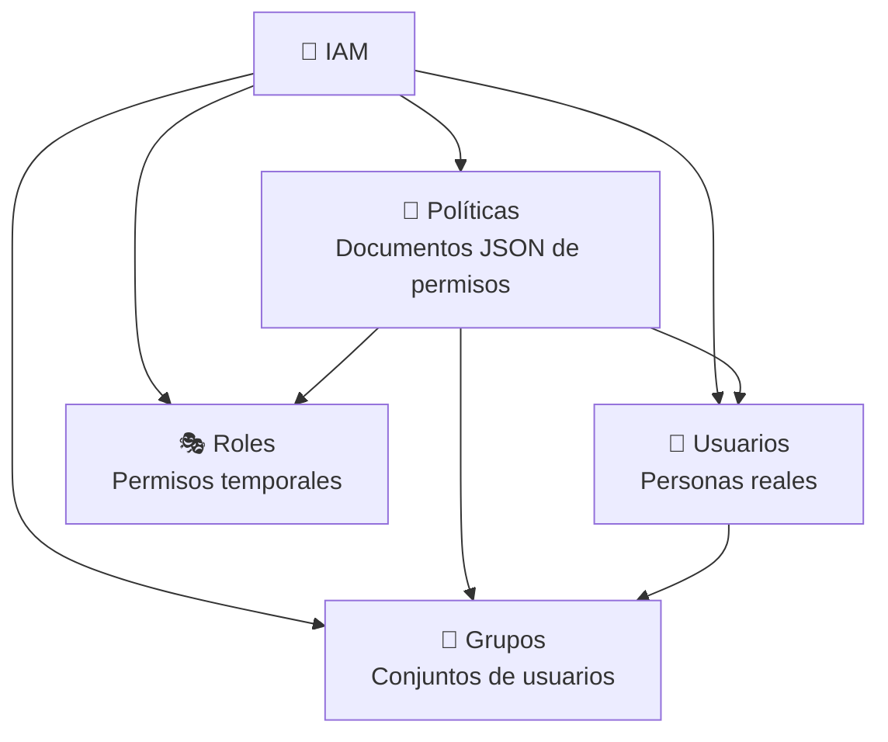

### Usuario IAM
- Representa una **persona o aplicación** que necesita acceder a AWS.
- Tiene **credenciales permanentes**: usuario/contraseña (consola) o Access Key/Secret Key (programático).
- **Principio de mínimo privilegio**: Da solo los permisos que necesita, nada más.
- ⚠️ **La cuenta root** (la que creas al registrarte) tiene acceso total. Nunca la uses para el día a día.

### Grupo IAM
- **Colección de usuarios** que comparten los mismos permisos.
- Los permisos se aplican al grupo, no a cada usuario individualmente.
- Un usuario puede pertenecer a **varios grupos**.

> **Ejemplo**: Grupo "Desarrolladores" con permisos de EC2 y S3. Grupo "DBAs" con permisos de RDS.
> Cuando un nuevo developer llega, lo añades al grupo → hereda todos los permisos automáticamente.

### Rol IAM (Role)
- **No es un usuario**. Es un conjunto de permisos **temporales** que puede asumir:
  - Un servicio AWS (ej: EC2 necesita leer de S3)
  - Un usuario de otra cuenta AWS
  - Una identidad federada (Google, Active Directory)
- **Clave**: Los roles NO tienen contraseña ni access keys permanentes. Las credenciales son temporales.

> **Ejemplo práctico**: Tu aplicación en EC2 necesita guardar archivos en S3. No pones las credenciales hardcodeadas en el código. Creas un Rol con permisos de S3 y se lo asignas a la instancia EC2. ¡Seguro y limpio!

### Política IAM (Policy)
- Documento **JSON** que define permisos.
- Sigue el esquema: **Efecto + Acción + Recurso**

```json
{
  "Version": "2012-10-17",
  "Statement": [
    {
      "Effect": "Allow",
      "Action": ["s3:GetObject", "s3:PutObject"],
      "Resource": "arn:aws:s3:::mi-bucket/*"
    }
  ]
}
```

- **Effect**: `Allow` (permite) o `Deny` (deniega). **Deny siempre gana sobre Allow.**
- **Action**: Qué operaciones (ej: `ec2:StartInstances`, `s3:*`)
- **Resource**: A qué recursos aplica (ARN específico o `*` para todos)

### Tipos de Políticas
| Tipo | Descripción |
|------|-------------|
| **Gestionadas por AWS** | AWS las crea y mantiene (ej: `AmazonS3FullAccess`) |
| **Gestionadas por cliente** | Tú las creas y gestionas |
| **En línea (inline)** | Embebidas directamente en un usuario/grupo/rol (menos recomendadas) |

### Buenas Prácticas IAM (muy preguntadas en el examen)
1. ✅ **Nunca usar la cuenta root** para tareas del día a día
2. ✅ **Activar MFA** para la cuenta root y usuarios con privilegios
3. ✅ **Principio de mínimo privilegio**: solo los permisos necesarios
4. ✅ Usar **roles** en lugar de access keys para servicios AWS
5. ✅ **Rotar las access keys** regularmente
6. ✅ Usar **grupos** para gestionar permisos, no asignar directamente a usuarios
7. ✅ Revisar y **auditar permisos** regularmente con IAM Access Analyzer

---

## 2.2 MFA — Multi-Factor Authentication

La autenticación de múltiples factores añade una **segunda capa de seguridad** además de la contraseña.

### Tipos de MFA en AWS
| Tipo | Descripción | Ejemplo |
|------|-------------|---------|
| **Aplicación autenticadora virtual** | App en el móvil que genera códigos TOTP | Google Authenticator, Authy |
| **Llave de seguridad hardware (FIDO)** | Dispositivo físico USB/NFC | YubiKey |
| **MFA hardware de tiempo** | Token físico que genera códigos | Dispositivo Gemalto |
| **MFA de SMS** | Código por mensaje de texto | (Menos seguro, disponible solo en algunas cuentas) |

> ⚠️ **Para el examen**: MFA en la cuenta root es **obligatorio** como buena práctica.

---

## 2.3 Cifrado en AWS

AWS ofrece cifrado **en reposo** y **en tránsito** para proteger tus datos.

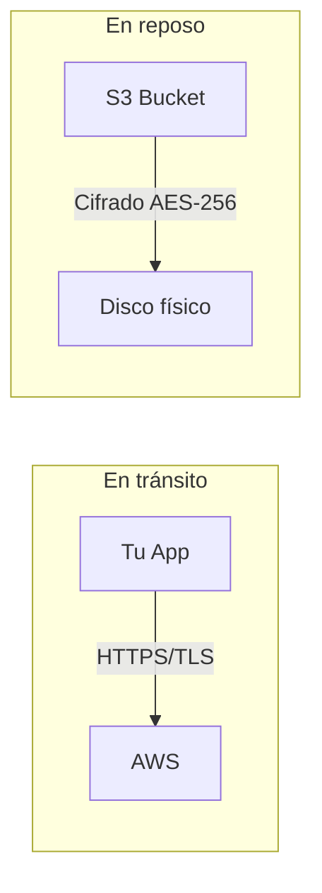

### Cifrado en Tránsito
- Los datos se cifran **mientras viajan** por la red.
- Usa protocolos **TLS/SSL** (HTTPS).
- AWS lo aplica automáticamente en muchos servicios.

### Cifrado en Reposo
- Los datos se cifran **cuando están almacenados** en disco.
- AWS ofrece:
  - **SSE-S3**: AWS gestiona las claves automáticamente
  - **SSE-KMS**: Las claves se gestionan con AWS KMS (Key Management Service)
  - **SSE-C**: Tú proporcionas tus propias claves

### AWS KMS (Key Management Service)
- Servicio para **crear, gestionar y controlar** claves de cifrado.
- Las claves **nunca salen de KMS** en texto plano.
- Se integra con casi todos los servicios de AWS.
- Registra **cada uso de una clave** en CloudTrail (auditoría completa).

### AWS CloudHSM
- **Hardware Security Module** dedicado **solo para ti** (no compartido).
- Más control que KMS (tú controlas las claves completamente).
- Más caro y complejo.
- Para requisitos de cumplimiento muy estrictos (PCI-DSS nivel 1, etc.).

> 🧠 **KMS vs CloudHSM**: KMS = AWS gestiona el hardware (compartido). CloudHSM = Hardware dedicado solo para ti.

---

## 2.4 Servicios de Seguridad AWS (los más importantes)

### AWS Shield — Protección DDoS

Un ataque DDoS (Distributed Denial of Service) intenta tumbar tu servicio inundándolo con tráfico falso.

| Nivel | Descripción | Coste |
|-------|-------------|-------|
| **Shield Standard** | Protección básica contra ataques DDoS comunes. Incluido **gratis** con todos los servicios AWS | Gratis |
| **Shield Advanced** | Protección avanzada, respuesta 24/7 del equipo DDoS de AWS, compensación económica si el ataque genera costes | ~3.000$/mes |

### AWS WAF — Web Application Firewall

- **Filtro de tráfico web** a nivel de aplicación (Capa 7).
- Protege contra: SQL Injection, Cross-Site Scripting (XSS), bots maliciosos.
- Funciona con: CloudFront, ALB, API Gateway.
- Creas **reglas** que permiten o bloquean solicitudes según patrones.

> **Diferencia Shield vs WAF**: Shield protege contra ataques volumétricos (DDoS). WAF filtra peticiones maliciosas individuales.

### Amazon Inspector
- Analiza automáticamente tus **instancias EC2 y contenedores** buscando:
  - Vulnerabilidades de software (CVEs conocidas)
  - Malas configuraciones de red
- Genera **informes de findings** con severidad.

> **Analogía**: Como un escáner de antivirus pero para infraestructura AWS.

### Amazon GuardDuty
- Servicio de **detección de amenazas** mediante Machine Learning.
- Analiza logs de: CloudTrail, VPC Flow Logs, DNS Logs.
- Detecta comportamientos anómalos: acceso desde IPs sospechosas, minería de criptomonedas, escalada de privilegios.
- **No necesita configuración de reglas**. AWS lo hace automáticamente.

> 🧠 **GuardDuty = Guardia** que vigila comportamientos extraños. Inspector = **Inspector** que revisa el estado de tus máquinas.

### AWS Macie
- Usa **Machine Learning** para descubrir y proteger **datos sensibles en S3**.
- Detecta: números de tarjetas de crédito, DNIs, contraseñas, datos PII (Personally Identifiable Information).
- Genera alertas cuando encuentra datos sensibles en buckets que no deberían tenerlos.

### AWS Secrets Manager
- Almacena, rota y gestiona **secretos**: contraseñas de bases de datos, API keys, credenciales.
- **Rotación automática** sin downtime (cambia la contraseña en el secreto y en la BD simultáneamente).
- Cobra por secreto almacenado y por API call.

### AWS Systems Manager Parameter Store
- Almacena **parámetros de configuración y secretos** (versión más simple y barata de Secrets Manager).
- Dos tipos: `String`, `StringList` (texto plano) y `SecureString` (cifrado con KMS).
- **Gratis** para parámetros estándar.

> 🧠 **Secrets Manager vs Parameter Store**: Secrets Manager = más completo, tiene rotación automática, más caro. Parameter Store = más simple, más barato, sin rotación automática nativa.

---

## 2.5 Servicios de Cumplimiento y Auditoría

### AWS CloudTrail

- Registra **todas las llamadas a la API de AWS** realizadas en tu cuenta.
- ¿Quién hizo qué, cuándo y desde dónde?
- Guarda logs en S3.
- **Muy importante para auditoría y cumplimiento**.

> **Ejemplo**: Alguien borró un bucket de S3 a las 3am. ¿Quién fue? → CloudTrail te lo dice.

> 🧠 **CloudTrail = rastro de huellas** (como un trail en el bosque). Quién ha pasado y cuándo.

### AWS Config
- Registra y evalúa la **configuración de tus recursos AWS** a lo largo del tiempo.
- Responde a: ¿Cómo estaba configurado este recurso hace 3 semanas?
- Puede enviar alertas cuando una configuración viola tus reglas.

> **Diferencia CloudTrail vs Config**:
> - CloudTrail: "¿Quién hizo la acción?" (actividad de usuario/API)
> - Config: "¿Cómo está configurado el recurso?" (estado de la infraestructura)

### AWS Audit Manager
- Automatiza la recopilación de **evidencias para auditorías** de cumplimiento.
- Soporta estándares: PCI-DSS, SOC, HIPAA, GDPR, etc.

### AWS Artifact
- Portal de **acceso a documentos de cumplimiento** de AWS:
  - Informes de auditoría (SOC 1, SOC 2, ISO 27001)
  - Acuerdos legales (BAA para HIPAA)
- Es **gratis** y accesible desde la consola de AWS.

> ⚠️ **Para el examen**: Si preguntan "¿Dónde descargo los informes de conformidad de AWS?" → **AWS Artifact**

---

## 2.6 Herramientas de Seguridad Adicionales

### Amazon Cognito
- Gestión de **identidad para aplicaciones** (autenticación de usuarios finales).
- Permite login con: usuario/contraseña propios, Google, Facebook, Apple, SAML.
- Dos componentes:
  - **User Pools**: Directorio de usuarios (registro, login, MFA)
  - **Identity Pools**: Otorga credenciales AWS temporales a usuarios autenticados

### AWS Directory Service
- Proporciona **Microsoft Active Directory** gestionado en AWS.
- Permite a los usuarios corporativos usar sus credenciales de empresa para acceder a servicios AWS.

### AWS IAM Identity Center (antes SSO)
- **Single Sign-On**: Un usuario se autentica una vez y accede a múltiples cuentas AWS y aplicaciones SaaS.
- Integra con Active Directory, Okta, etc.

### Amazon Detective
- Analiza y visualiza datos de seguridad para **investigar incidentes**.
- Se alimenta de GuardDuty, CloudTrail y VPC Flow Logs.
- Usa grafos para mostrar relaciones entre entidades.

> 🧠 **Detector vs Detective**: GuardDuty **detecta** amenazas. Detective **investiga** qué pasó después de un incidente.

### AWS Security Hub
- Panel **centralizado de seguridad** que agrega findings de:
  - GuardDuty, Inspector, Macie, Firewall Manager, etc.
- Puntúa tu postura de seguridad contra estándares (AWS Best Practices, CIS Benchmarks, PCI-DSS).

---

## 2.7 Principios de Seguridad en AWS

### Zero Trust (Confianza Cero)
No confíes en ningún usuario o servicio por defecto, ni siquiera los que están dentro de tu red. Verifica siempre.

### Defensa en Profundidad (Defense in Depth)
Múltiples capas de seguridad. Si una falla, las demás protegen.

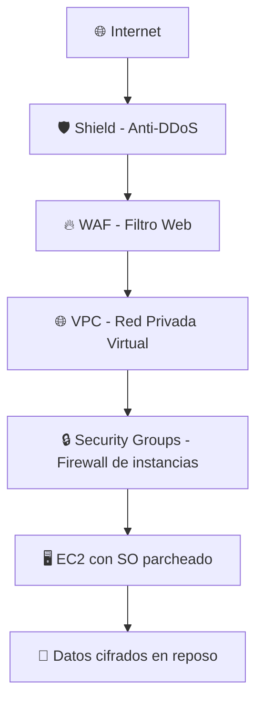

### Principio de Mínimo Privilegio
Otorga solo los permisos **mínimos necesarios** para realizar una tarea. Nada más.

### Segregación de Cuentas AWS
Para empresas grandes, usar múltiples cuentas AWS separadas por:
- Entorno (Producción, Staging, Desarrollo)
- Equipo o unidad de negocio
- **AWS Organizations** permite gestionar múltiples cuentas de forma centralizada.

---

## 2.8 AWS Organizations y Control Tower

### AWS Organizations
- Gestiona **múltiples cuentas AWS** desde una cuenta maestra (management account).
- Permite:
  - Consolidar la **facturación** (un solo pago para todas las cuentas)
  - Aplicar **SCPs (Service Control Policies)**: límites máximos de permisos para cuentas hijas

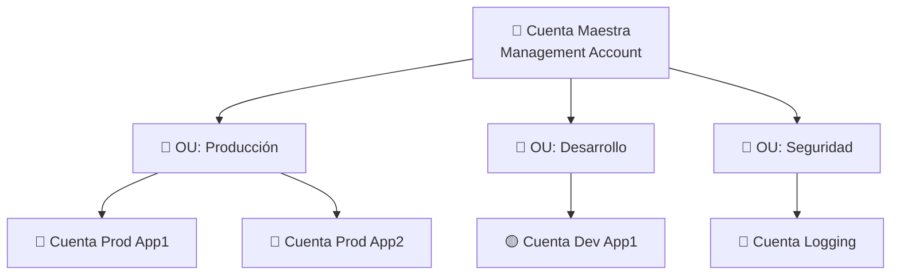

### SCP — Service Control Policies
- Políticas que definen los **permisos máximos** para cuentas dentro de una OU.
- **No otorgan permisos**, solo los limitan.
- Ejemplo: SCP que impide a todas las cuentas de desarrollo crear recursos en regiones fuera de Europa.

### AWS Control Tower
- Servicio para **configurar y gobernar** un entorno multi-cuenta de forma automatizada.
- Implementa el "Landing Zone": estructura de cuentas con seguridad y cumplimiento desde el inicio.


---

# ⚙️ DOMINIO 3: Tecnología y Servicios en la Nube (34%)

> El dominio más extenso. Cubre los principales servicios de AWS. No necesitas ser experto, pero sí saber para qué sirve cada uno.

## 3.1 Computación — Amazon EC2

EC2 (Elastic Compute Cloud) son **máquinas virtuales en la nube**. Es el servicio de computación más fundamental de AWS.

### Conceptos clave de EC2

**AMI (Amazon Machine Image)**
- Es la "foto" o plantilla del sistema operativo y software de tu instancia.
- Antes de lanzar una EC2, eliges una AMI (Amazon Linux, Ubuntu, Windows Server, etc.).
- Puedes crear tus propias AMIs personalizadas.

**Tipos de instancia**
Los nombres tienen un formato: `familia` + `generación` + `tamaño`

Ejemplo: `t3.medium` = familia T (general purpose), generación 3, tamaño medium

| Familia | Uso | Ejemplo |
|---------|-----|---------|
| **T** (General Purpose) | Uso general, web apps, dev/test | t3.micro |
| **M** (General Purpose) | Servidores web, bases de datos medianas | m6i.large |
| **C** (Compute Optimized) | Procesamiento intensivo, HPC, gaming | c6g.xlarge |
| **R** (Memory Optimized) | Bases de datos en memoria, caché | r6i.2xlarge |
| **I/D** (Storage Optimized) | Bases de datos NoSQL, data warehousing | i3.large |
| **P/G** (GPU) | Machine learning, renderizado | p3.xlarge |

> 🧠 **Mnemotecnia**: **T**rabajo general, **C**omputación intensiva, **R**AM mucha, **I**nput/Output disco = **TCRI**

### Modelos de Compra de EC2 (¡MUY IMPORTANTE para el examen!)

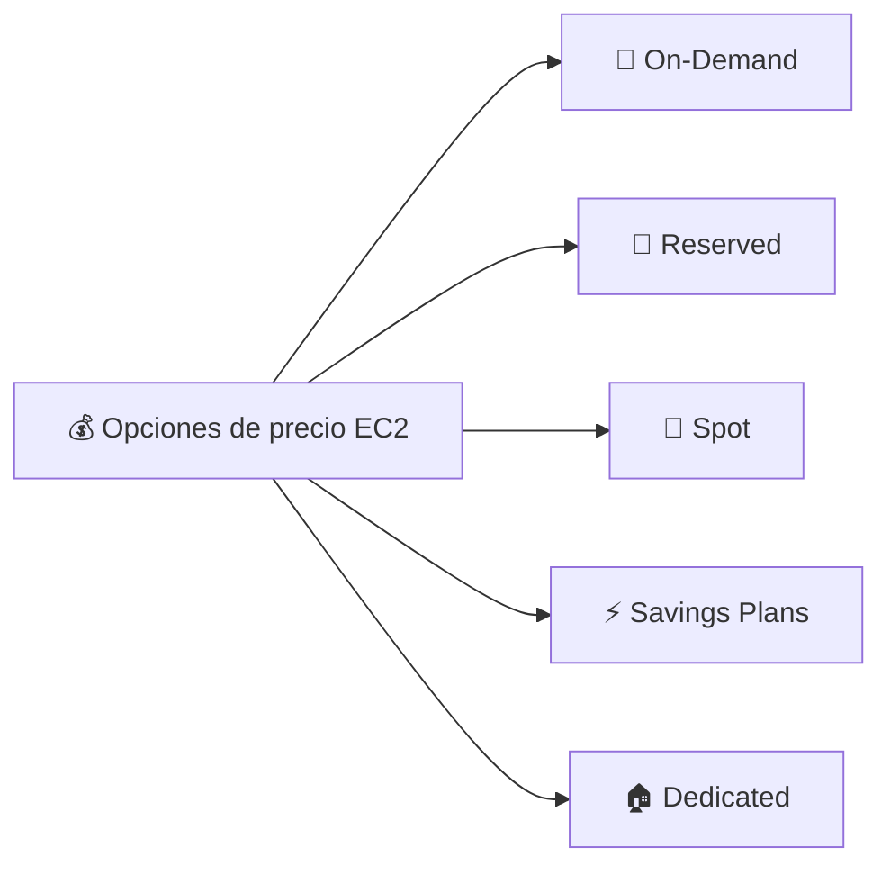

| Modelo | Descripción | Descuento | Cuándo usar |
|--------|-------------|-----------|-------------|
| **On-Demand** | Pagas por hora/segundo. Sin compromisos | 0% (precio base) | Dev/test, cargas impredecibles |
| **Reserved (1 o 3 años)** | Te comprometes 1 o 3 años | Hasta 75% | Cargas estables y predecibles (prod) |
| **Spot** | Usas capacidad sobrante de AWS a precio reducido (puede interrumpirse) | Hasta 90% | Trabajos tolerantes a interrupciones (big data, renderizado) |
| **Savings Plans** | Compromiso de gasto por hora (más flexible que Reserved) | Hasta 66% | Uso flexible entre tipos de instancia |
| **Dedicated Hosts** | Servidor físico dedicado solo para ti | Variable (más caro) | Requisitos de licencia o cumplimiento |
| **Dedicated Instances** | Instancias en hardware dedicado | Menos que Dedicated Hosts | Aislamiento de hardware por compliance |

> 🧠 **Para recordar**:
> - **On-Demand**: Como un taxi, pagas por viaje, sin compromiso
> - **Reserved**: Como un abono de tren, más barato porque te comprometes
> - **Spot**: Como subastas de última hora en vuelos, muy barato pero puede cancelarse
> - **Savings Plans**: Como un bono de consumo flexible

### Opciones de Almacenamiento de EC2

**EBS (Elastic Block Store)**
- Disco duro virtual que **se adjunta a una instancia EC2**.
- Persiste aunque pares o termines la instancia (si lo configuras así).
- Solo se puede adjuntar a **una instancia a la vez** (en la misma AZ).
- Tipos: `gp3` (propósito general, SSD), `io2` (alto rendimiento, SSD), `st1` (HDD frío).

**Instance Store**
- Almacenamiento **físico directo** del servidor donde corre tu instancia.
- **Muy rápido** (NVMe SSD).
- **Efímero**: Si apagas la instancia, **los datos se pierden**. Solo persiste mientras corre.
- Para buffers temporales, caché, datos que se regeneran.

**EFS (Elastic File System)**
- Sistema de archivos **compartido** que pueden montar múltiples instancias EC2 simultáneamente.
- Como un disco de red (NFS).
- Escala automáticamente.
- Multi-AZ.

> 🧠 **EBS vs EFS**: EBS = un disco para una instancia. EFS = disco compartido para muchas instancias.

### Auto Scaling

Permite que AWS **ajuste automáticamente** el número de instancias EC2 según la demanda.

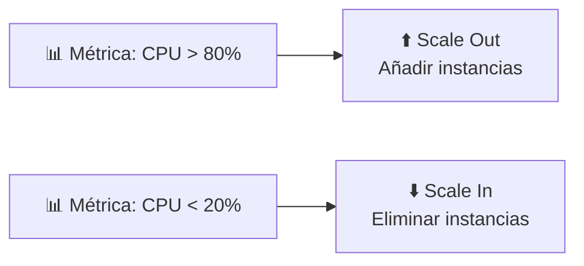

- **Scale Out**: Añadir más instancias (escalar horizontalmente)
- **Scale In**: Eliminar instancias
- Se configura con: mínimo, máximo y capacidad deseada
- Funciona junto con **ELB (Elastic Load Balancer)**

---

## 3.2 Balanceo de Carga — ELB (Elastic Load Balancer)

Distribuye el tráfico entrante entre múltiples instancias para:
- **Alta disponibilidad**: Si una instancia falla, el tráfico va a las sanas
- **Escalabilidad**: Distribuir la carga entre varias instancias

### Tipos de Load Balancer

| Tipo | Capa OSI | Protocolo | Caso de uso |
|------|----------|-----------|-------------|
| **ALB (Application)** | Capa 7 (HTTP) | HTTP/HTTPS | Apps web, microservicios, routing por URL |
| **NLB (Network)** | Capa 4 (TCP) | TCP/UDP/TLS | Muy alto rendimiento, baja latencia, gaming |
| **GLB (Gateway)** | Capa 3 | IP | Appliances virtuales (firewalls de terceros) |
| **CLB (Classic)** | Capa 4/7 | Legacy | Antiguo, no recomendado para nuevas apps |

> 🧠 **Para el examen**: ALB para HTTP/web apps. NLB para TCP/rendimiento extremo.

---

## 3.3 Computación Serverless

Serverless no significa que no hay servidores — significa que **tú no gestionas los servidores**. AWS lo hace todo.

### AWS Lambda

- Ejecuta **código sin provisionar servidores**.
- Pagas solo por las **invocaciones y tiempo de ejecución** (no por servidores en reposo).
- Se ejecuta en respuesta a **eventos** (petición HTTP, archivo subido a S3, mensaje en SQS...).
- Soporta: Node.js, Python, Java, Go, Ruby, .NET, etc.
- Límite de tiempo: **15 minutos por ejecución**.

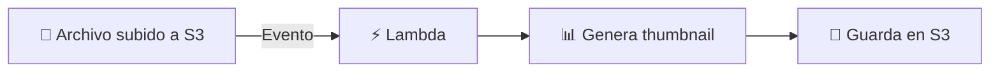

> **Ejemplo de uso**: Sistema que genera thumbnails automáticamente cuando se suben imágenes a S3.

### AWS Fargate
- Ejecuta **contenedores Docker sin gestionar servidores** (el motor de ECS/EKS sin servidores).
- Pagas por las CPU y memoria que usan tus contenedores.

### Amazon ECS vs EKS
| Servicio | Descripción |
|----------|-------------|
| **ECS (Elastic Container Service)** | Orquestador de contenedores **propio de AWS** |
| **EKS (Elastic Kubernetes Service)** | **Kubernetes** gestionado por AWS |

### AWS Elastic Beanstalk
- **PaaS**: Solo subes tu código, AWS gestiona todo lo demás (EC2, balanceador, escalado, monitorización).
- Soporta: Java, .NET, PHP, Node.js, Python, Ruby, Go, Docker.
- Ideal para developers que no quieren gestionar infraestructura.

---

## 3.4 Almacenamiento — S3 (Simple Storage Service)

S3 es el servicio de **almacenamiento de objetos** de AWS. Puedes guardar cualquier tipo de archivo.

### Conceptos de S3

- **Bucket**: Contenedor de objetos (como una carpeta raíz). El nombre es **globalmente único**.
- **Objeto**: El archivo que guardas + sus metadatos. Hasta **5 TB** por objeto.
- **Clave (Key)**: La "ruta" del objeto dentro del bucket (ej: `imagenes/foto.jpg`).

### Clases de almacenamiento S3 (¡importantes para el examen!)

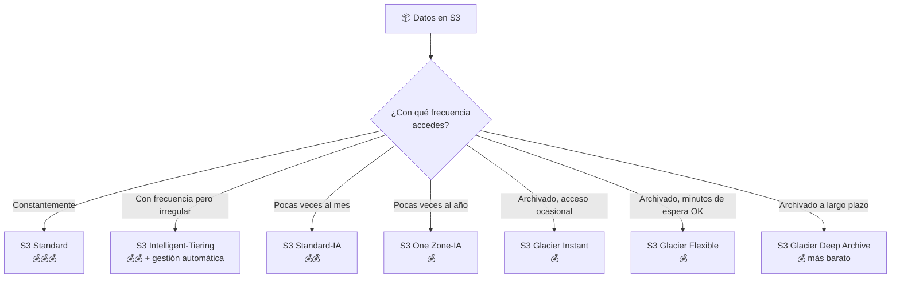

| Clase | Acceso | Coste almacenamiento | Coste recuperación | Mínimo |
|-------|--------|---------------------|-------------------|--------|
| **Standard** | Frecuente | Alto | Bajo | Ninguno |
| **Intelligent-Tiering** | Variable | Medio | Bajo | Ninguno |
| **Standard-IA** | Infrecuente | Medio-bajo | Medio | 30 días |
| **One Zone-IA** | Infrecuente | Bajo | Medio | 30 días |
| **Glacier Instant Retrieval** | Trimestral | Muy bajo | Bajo | 90 días |
| **Glacier Flexible Retrieval** | Semestral | Muy bajo | Alto (1-12h) | 90 días |
| **Glacier Deep Archive** | Anual | Mínimo | Muy alto (12-48h) | 180 días |

> 🧠 **Para recordar**: Más "frío" = más barato guardar, más caro recuperar, más tiempo esperas.

### S3 — Características clave

**Versionado (Versioning)**
- Guarda **múltiples versiones** del mismo objeto.
- Protege contra borrado accidental.
- Para eliminar definitivamente, debes eliminar todas las versiones.

**Ciclo de Vida (Lifecycle Policies)**
- Mueve automáticamente objetos entre clases o los elimina según su antigüedad.
- Ejemplo: Después de 30 días → mover a Standard-IA. Después de 365 días → mover a Glacier.

**Replicación**
- **CRR (Cross-Region Replication)**: Copia objetos a otra región automáticamente.
- **SRR (Same-Region Replication)**: Copia en la misma región (para compliance o logs).

**S3 Static Website Hosting**
- Puedes alojar un sitio web estático (HTML, CSS, JS) directamente en S3.
- Muy barato y no necesitas servidores.

**Acceso Público vs Privado**
- Por defecto, **todos los buckets son PRIVADOS**.
- Puedes hacer objetos/buckets públicos (hay una opción "Block Public Access" activada por defecto).

**Bloqueo de Objetos (Object Lock)**
- Previene que los objetos sean eliminados o modificados durante un período determinado.
- Para compliance (finanzas, medicina) que requieren inmutabilidad de datos.

---

## 3.5 Redes — VPC y Servicios de Red

### VPC — Virtual Private Cloud

Una VPC es tu **red privada virtual dentro de AWS**. Es como tener tu propio data center virtual aislado del resto.

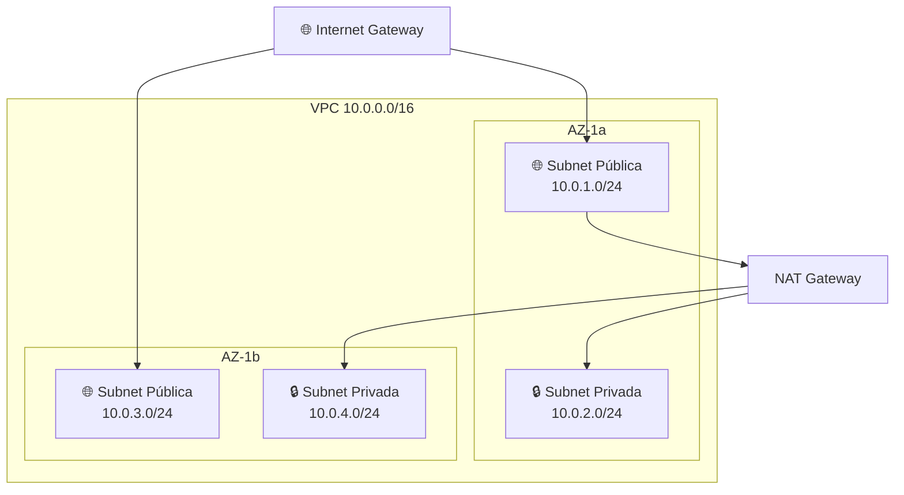

**Componentes de una VPC**

| Componente | Descripción |
|-----------|-------------|
| **Subnet** | Subdivisión de la VPC en una AZ. Pública (accede a internet) o Privada (no accede directamente) |
| **Internet Gateway (IGW)** | Permite comunicación entre la VPC e internet |
| **NAT Gateway** | Permite que subnets privadas **salgan** a internet sin ser accesibles desde fuera |
| **Route Table** | Define cómo se enruta el tráfico dentro de la VPC |
| **Security Group** | Firewall **a nivel de instancia** (stateful: si permites entrada, la salida de esa conexión se permite automáticamente) |
| **Network ACL (NACL)** | Firewall **a nivel de subnet** (stateless: debes definir reglas de entrada Y salida explícitamente) |

> 🧠 **Security Group vs NACL**:
> - Security Group: Guarda la "memoria" de la conexión (stateful). Solo se aplica a nivel de instancia.
> - NACL: No tiene memoria (stateless). Primera línea de defensa. Se aplica a toda la subnet.

### Subnet Pública vs Privada

| | Pública | Privada |
|-|---------|---------|
| **Acceso desde internet** | Sí (a través de IGW) | No directo |
| **Acceso a internet** | Sí | Solo a través de NAT Gateway |
| **Usada para** | Servidores web, load balancers | Bases de datos, servidores de app |

### VPC Peering
- Conecta **dos VPCs** (misma o diferente cuenta/región) de forma privada.
- El tráfico no pasa por internet.
- No transitivo: si A-B y B-C, A no puede hablar con C.

### AWS VPN
- Conecta tu **red on-premise** con tu VPC a través de internet (túnel cifrado).
- **Site-to-Site VPN**: Tu oficina ↔ VPC
- **Client VPN**: Tu ordenador personal ↔ VPC

### AWS Direct Connect
- Conexión **física dedicada** entre tu data center y AWS (no pasa por internet).
- Más estable, mayor ancho de banda, menor latencia que VPN.
- Más caro y tarda semanas en configurarse.

> 🧠 **VPN vs Direct Connect**: VPN = autopista (internet, puede haber tráfico). Direct Connect = carretera privada (solo tuya, más rápida y estable).

### AWS Transit Gateway
- Actúa como un **hub central** que conecta múltiples VPCs y redes on-premise.
- Sin él, necesitas peering N*(N-1)/2 conexiones. Con él, solo conectas cada VPC al hub.

---

## 3.6 Bases de Datos en AWS

### Amazon RDS — Relational Database Service

Base de datos **relacional gestionada**. AWS gestiona: backups, parches, alta disponibilidad, failover.

Motores soportados: **MySQL, PostgreSQL, MariaDB, Oracle, SQL Server, Aurora**

**RDS Multi-AZ**
- AWS mantiene una **réplica sincrónica** en otra AZ.
- Si la principal falla, el failover es automático (~1-2 minutos).
- Para **alta disponibilidad** (no para escalar lecturas).

**RDS Read Replicas**
- Réplicas **asíncronas** de solo lectura.
- Para **escalar lecturas** (no para alta disponibilidad directamente).
- Pueden estar en la misma AZ, diferente AZ, o diferente región.

> 🧠 **Multi-AZ vs Read Replicas**:
> - Multi-AZ = Seguro ante fallos (HA). No mejora rendimiento de lecturas.
> - Read Replicas = Más velocidad de lectura. No es failover automático.

### Amazon Aurora

- Base de datos relacional **propia de AWS** (compatible con MySQL y PostgreSQL).
- Hasta **5x más rápida** que MySQL estándar y 3x más que PostgreSQL.
- **Almacenamiento se escala automáticamente** (de 10 GB hasta 128 TB).
- Replica datos en **3 AZs con 6 copias automáticamente**.
- **Aurora Serverless**: Escala automáticamente según la carga (sin provisionar capacidad).

### Amazon DynamoDB

- Base de datos **NoSQL, clave-valor y documentos**, totalmente gestionada y serverless.
- **Latencia de milisegundos** a cualquier escala.
- Escala automáticamente, sin mantenimiento.
- **DAX (DynamoDB Accelerator)**: Caché en memoria para DynamoDB → latencia de microsegundos.

> 🧠 **RDS = SQL, relacional, esquema fijo**. **DynamoDB = NoSQL, flexible, velocidad extrema**.

### Amazon ElastiCache

- Servicio de **caché en memoria** gestionado.
- Dos motores: **Redis** (más completo, persistencia, pub/sub) y **Memcached** (simple, multihilo).
- Reduce la carga de la base de datos cachando resultados de consultas frecuentes.

### Amazon Redshift

- **Data Warehouse** (almacén de datos) para **analítica** a gran escala.
- Consultas SQL sobre petabytes de datos.
- No para OLTP (transacciones), sino para OLAP (análisis, BI, informes).

### Amazon DocumentDB
- Compatible con **MongoDB**. Base de datos de documentos JSON gestionada.

### Amazon Neptune
- Base de datos de **grafos** gestionada. Para redes sociales, motores de recomendación, detección de fraude.

### Amazon QLDB (Quantum Ledger Database)
- Base de datos de **libro mayor (ledger) inmutable**. Para transacciones financieras auditables.

---

## 3.7 Integración de Aplicaciones — Mensajería y Eventos

### Amazon SQS — Simple Queue Service

- **Cola de mensajes** gestionada para desacoplar componentes.
- Un productor envía mensajes, un consumidor los lee y procesa.
- El mensaje permanece en la cola hasta que el consumidor lo elimina.
- **Tipos**:
  - **Standard**: Orden no garantizado, puede haber duplicados, máxima throughput.
  - **FIFO**: Orden garantizado, sin duplicados, hasta 3.000 mensajes/segundo.

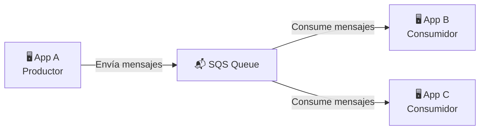

> **Analogía**: Como una cola de supermercado. Los clientes (mensajes) esperan en la cola. Los cajeros (consumidores) los atienden a su ritmo.

### Amazon SNS — Simple Notification Service

- Servicio de **publicación/suscripción (pub/sub)**.
- Un publicador manda un mensaje a un **topic**, y todos los suscriptores lo reciben.
- Suscriptores pueden ser: SQS, Lambda, HTTP/HTTPS endpoints, email, SMS.

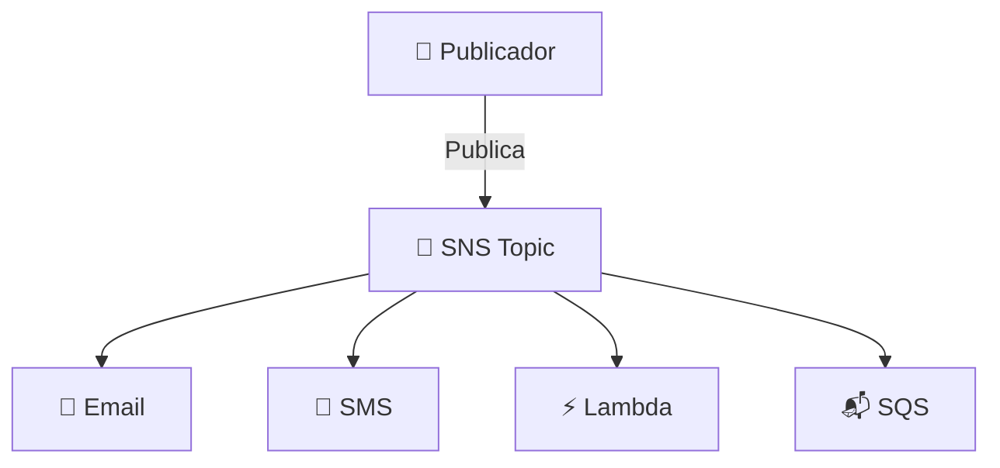

> 🧠 **SQS vs SNS**:
> - SQS = Cola → Un mensaje, un consumidor (pull)
> - SNS = Broadcast → Un mensaje, muchos suscriptores (push)

### Amazon EventBridge
- **Bus de eventos** para conectar aplicaciones usando eventos.
- Antes llamado CloudWatch Events.
- Puede recibir eventos de servicios AWS, aplicaciones SaaS (Salesforce, Zendesk) y tus propias apps.

### AWS Step Functions
- **Orquestador de flujos de trabajo** serverless.
- Coordina múltiples servicios AWS (Lambda, ECS, SQS...) en una secuencia de pasos.
- Visual: puedes ver el flujo como un diagrama.

---

## 3.8 Entrega de Contenido y DNS

### Amazon CloudFront — CDN

**Content Delivery Network**: Distribuye tu contenido desde **Edge Locations** (puntos de presencia de AWS) cercanas al usuario final.

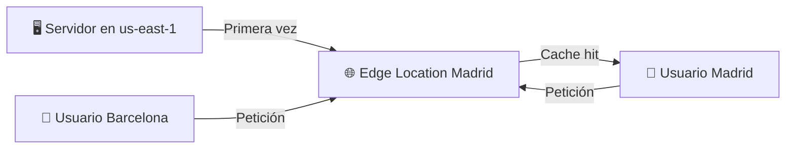

- **Beneficios**: Menor latencia, menos carga en el origen, protección DDoS (Shield Standard incluido).
- **Orígenes**: S3, EC2, ALB, cualquier servidor HTTP.
- Los objetos se cachean en la Edge Location según el TTL configurado.

### Amazon Route 53 — DNS

- Servicio de **DNS (Domain Name System)** de AWS. Convierte nombres de dominio en IPs.
- También permite registrar dominios.
- **Políticas de enrutamiento**:

| Política | Descripción | Caso de uso |
|----------|-------------|-------------|
| **Simple** | Devuelve siempre la misma IP | Un único servidor |
| **Failover** | Si el primario falla, redirige al secundario | Alta disponibilidad |
| **Weighted** | Distribuye según porcentajes (70% a server A, 30% a server B) | A/B testing, migración gradual |
| **Latency** | Redirige al servidor con menor latencia | Apps globales |
| **Geolocation** | Redirige según ubicación geográfica del usuario | Contenido regional |
| **Geoproximity** | Redirige según proximidad geográfica (configurable) | Control fino de routing |
| **Multi-Value** | Devuelve múltiples IPs saludables | Distribución simple de carga |

---

## 3.9 Monitorización y Observabilidad

### Amazon CloudWatch

- Plataforma de **monitorización y observabilidad** central de AWS.

**Métricas (Metrics)**
- Datos numéricos sobre el comportamiento de recursos (CPU, memoria, requests, etc.).
- Período mínimo de retención: por defecto, métricas estándar cada 5 min; métricas detalladas cada 1 min.

**Logs**
- CloudWatch Logs centraliza **logs de aplicaciones y servicios**.
- Log Groups → Log Streams → Log Events.
- Puedes definir **Metric Filters** para extraer métricas de logs.

**Alarmas (Alarms)**
- Disparan acciones cuando una métrica supera un umbral.
- Acciones: enviar email (SNS), escalar EC2 (Auto Scaling), ejecutar Lambda.
- Estados: `OK`, `ALARM`, `INSUFFICIENT_DATA`.

**CloudWatch Dashboard**
- Panel visual con métricas en tiempo real.

**CloudWatch Events / EventBridge**
- Reacciona a cambios en los recursos AWS o en un horario (cron).

### AWS X-Ray
- Herramienta de **rastreo distribuido (distributed tracing)**.
- Permite ver el flujo de una petición a través de múltiples microservicios.
- Muestra cuellos de botella, errores y tiempos de respuesta.

> 🧠 **CloudWatch = qué está pasando (métricas/logs)**. **X-Ray = por qué está tardando (trazas de peticiones)**.

---

## 3.10 Herramientas de Desarrollo y DevOps

### AWS CodeCommit
- **Repositorio Git** gestionado (como GitHub privado en AWS).
- Completamente integrado con otros servicios AWS.

### AWS CodeBuild
- Servicio de **compilación y testing** en la nube.
- Compila código fuente, ejecuta tests y produce artefactos.

### AWS CodeDeploy
- **Despliegue automático** de aplicaciones a EC2, Lambda, ECS.
- Soporta: rolling updates, blue/green deployments, canary.

### AWS CodePipeline
- **Pipeline de CI/CD** (Continuous Integration/Continuous Deployment).
- Orquesta CodeCommit → CodeBuild → CodeDeploy en un flujo automatizado.

### AWS CloudFormation
- **Infrastructure as Code (IaC)**: Define tu infraestructura en ficheros YAML/JSON (templates).
- AWS crea y gestiona los recursos automáticamente.
- **Stack**: Colección de recursos AWS creados desde un template.

> 🧠 **CloudFormation = receta** para crear tu infraestructura. Si la sigues, siempre obtienes lo mismo.

### AWS CDK (Cloud Development Kit)
- IaC usando lenguajes de programación reales (TypeScript, Python, Java...) en vez de YAML.
- Genera CloudFormation templates bajo el capó.

### AWS SAM (Serverless Application Model)
- Simplifica la definición de aplicaciones serverless (Lambda, API Gateway, DynamoDB).
- Extensión de CloudFormation con sintaxis simplificada.

---

## 3.11 Machine Learning e IA en AWS

Para Cloud Practitioner no necesitas saber cómo funcionan, solo **para qué sirven**.

| Servicio | ¿Para qué sirve? |
|----------|-----------------|
| **Amazon SageMaker** | Crear, entrenar y desplegar modelos de ML (plataforma completa) |
| **Amazon Rekognition** | Análisis de imágenes y vídeos (detección de caras, objetos, texto) |
| **Amazon Transcribe** | Speech-to-Text (audio/vídeo a texto) |
| **Amazon Polly** | Text-to-Speech (texto a voz) |
| **Amazon Translate** | Traducción automática de textos |
| **Amazon Comprehend** | Análisis de texto (sentimientos, entidades, idioma) — NLP |
| **Amazon Lex** | Crear chatbots (misma tecnología que Alexa) |
| **Amazon Kendra** | Motor de búsqueda inteligente con ML |
| **Amazon Personalize** | Motor de recomendaciones personalizado (como Netflix) |
| **Amazon Forecast** | Predicciones de series temporales (demanda, ventas) |
| **Amazon Textract** | Extrae texto y datos de documentos escaneados (OCR avanzado) |
| **Amazon CodeWhisperer** | Asistente de código con IA (como GitHub Copilot) |
| **Amazon Bedrock** | Acceso a modelos fundacionales (FM) y LLMs para generar IA generativa |

---

## 3.12 Migración a AWS

### AWS Snow Family

Dispositivos **físicos** para transferir grandes volúmenes de datos a AWS cuando internet es demasiado lento o costoso.

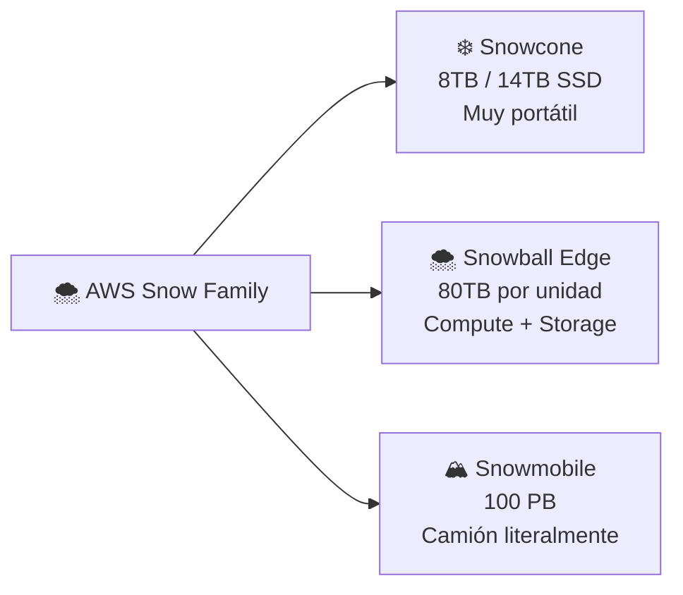

| Dispositivo | Capacidad | Uso |
|-------------|-----------|-----|
| **Snowcone** | 8 TB HDD / 14 TB SSD | Edge computing portátil, migración pequeña |
| **Snowball Edge Storage Optimized** | 80 TB | Migración de datos a escala grande |
| **Snowball Edge Compute Optimized** | 42 TB + GPU | Edge computing con procesamiento potente |
| **Snowmobile** | 100 PB (camión de datos) | Migración de data centers completos |

> 🧠 **Regla**: Si tienes más de **1 semana** de tiempo de transferencia por internet → considera Snow Family.

### AWS DataSync
- **Transferencia de datos en línea** entre on-premise y AWS (o entre servicios de almacenamiento AWS).
- Más rápido que herramientas estándar. Automatiza y programa transferencias.

### AWS Transfer Family
- Transferencias de archivos usando protocolos **SFTP, FTPS, FTP** hacia S3 o EFS.
- Para organizaciones que ya usan estos protocolos y no quieren cambiar.

### AWS Migration Hub
- **Panel centralizado** para rastrear el progreso de migraciones a AWS.

### AWS Application Migration Service (MGN)
- **Lift-and-Shift** automatizado: mueve tus servidores tal cual a AWS.
- Replica el disco de tus servidores on-premise a AWS en tiempo real.

### AWS Database Migration Service (DMS)
- Migra bases de datos a AWS con mínimo downtime.
- Puede migrar entre **diferentes tipos** de motor (MySQL on-premise → Aurora en AWS).

### AWS Schema Conversion Tool (SCT)
- Convierte **esquemas de base de datos** cuando cambias de motor (Oracle → PostgreSQL).
- Se usa junto con DMS.

---

## 3.13 Otros Servicios Importantes

### Amazon API Gateway
- Crea, publica y gestiona **APIs REST, HTTP y WebSocket**.
- Integra con Lambda para crear APIs serverless.
- Maneja: autenticación, rate limiting, throttling, caching.

### Amazon SES (Simple Email Service)
- Servicio de **envío de emails** masivos y transaccionales (facturas, notificaciones).

### Amazon Pinpoint
- **Comunicaciones de marketing** multicanal: email, SMS, push, voz.

### AWS Glue
- Servicio de **ETL (Extract, Transform, Load)** serverless.
- Descubre, transforma y carga datos para analytics.

### Amazon Athena
- Servicio de **consultas SQL sobre S3** usando Presto.
- No necesitas cargar los datos, los consultas directamente donde están.
- Pagas por datos escaneados.

### Amazon QuickSight
- Servicio de **Business Intelligence (BI)** y visualización de datos.
- Dashboards e informes interactivos.

### AWS Lake Formation
- Facilita la creación de un **data lake** en S3 con gobernanza y seguridad.

### Amazon Kinesis
- Plataforma para **streaming de datos en tiempo real**.
- **Kinesis Data Streams**: Ingestión de streams de datos.
- **Kinesis Data Firehose**: Carga streams en S3, Redshift, Elasticsearch.
- **Kinesis Data Analytics**: Análisis SQL en tiempo real sobre streams.


---

# 💰 DOMINIO 4: Facturación, Precios y Soporte (12%)

## 4.1 Modelos de Precios de AWS

AWS cobra basándose en tres principios fundamentales:

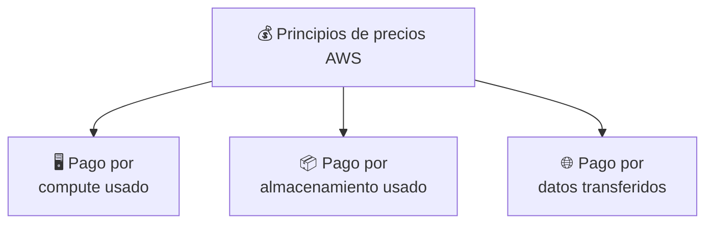

1. **Pago por uso**: Solo pagas lo que consumes, cuando lo consumes.
2. **Paga menos si reservas**: Comprometerte con 1 o 3 años te da descuentos importantes.
3. **Paga menos si usas más**: A mayor volumen, menor precio por unidad (economías de escala).

### Cargos de Transferencia de Datos
- **Entrada de datos a AWS** (Inbound): Generalmente **gratis**.
- **Salida de datos de AWS** (Outbound to Internet): **Se cobra** (varía por región).
- **Transferencia entre servicios en la misma AZ**: Gratis.
- **Transferencia entre AZs de la misma región**: Se cobra.
- **Transferencia entre regiones**: Se cobra.

> 🧠 **Regla**: Entrar a AWS = gratis. Salir de AWS = se paga. Moverse entre regiones = se paga.

---

## 4.2 Herramientas de Costes y Facturación

### AWS Pricing Calculator
- Herramienta **web** para **estimar el coste** de una arquitectura AWS antes de desplegarla.
- Añades los servicios que planeas usar y calcula un coste mensual estimado.
- URL: calculator.aws

### AWS Cost Explorer
- Herramienta para **analizar y visualizar** tus costes **históricos y futuros** de AWS.
- Puedes ver: qué servicios cuestan más, en qué región, qué cuenta, etc.
- **Forecasting**: Predice costes futuros basándose en el histórico.
- Filtra por: servicio, región, etiqueta (tag), cuenta.

### AWS Budgets
- Configura **alertas** cuando el gasto real o previsto supera un umbral definido.
- Tipos de budgets:
  - **Cost Budget**: Alerta cuando el gasto supera X dólares.
  - **Usage Budget**: Alerta cuando el uso supera X unidades.
  - **Reservation Budget**: Monitoriza la utilización de Reserved Instances.
  - **Savings Plans Budget**: Monitoriza la utilización de Savings Plans.

> 🧠 **Pricing Calculator = estimar antes de usar**. **Cost Explorer = analizar lo que ya gastaste**. **Budgets = alertarte cuando gastas de más**.

### AWS Cost and Usage Report (CUR)
- El **informe más detallado** de costes de AWS.
- Se exporta a S3 en formato CSV.
- Desglose completo: por servicio, por hora, por recurso, por tag.
- Usado para análisis avanzados con Athena o QuickSight.

### AWS Billing Dashboard
- Vista general de tu factura mensual desde la consola de AWS.

---

## 4.3 AWS Free Tier (Capa Gratuita)

AWS ofrece tres tipos de ofertas gratuitas:

| Tipo | Descripción | Ejemplo |
|------|-------------|---------|
| **12 meses gratis** | Disponible los 12 primeros meses desde tu registro | 750h/mes de EC2 t2.micro, 5 GB de S3 |
| **Siempre gratis** | Sin caducidad, para siempre | 1 millón de invocaciones Lambda/mes, 25 GB DynamoDB |
| **Pruebas de corta duración** | Trial gratuito desde la primera activación del servicio | 90 días de SageMaker, 60 días de GuardDuty |

> ⚠️ **Para el examen**: Conoce los ejemplos más comunes de Free Tier:
> - EC2: 750 horas/mes de t2.micro o t3.micro (12 meses)
> - S3: 5 GB de almacenamiento Standard (12 meses)
> - Lambda: 1 millón de invocaciones gratis (siempre)
> - DynamoDB: 25 GB de almacenamiento (siempre)
> - CloudFront: 1 TB de transferencia de datos (12 meses)

---

## 4.4 AWS Organizations y Facturación Consolidada

### Facturación Consolidada (Consolidated Billing)

Con AWS Organizations puedes **consolidar la facturación** de múltiples cuentas en una sola.

**Ventajas**:
1. **Un solo pago** para todas las cuentas → simplifica la gestión.
2. **Economías de escala**: El uso de todas las cuentas se suma para obtener mejores descuentos por volumen.
3. **Compartir Reserved Instances**: Una cuenta con Reserved Instances puede compartirlas con otras cuentas de la organización.

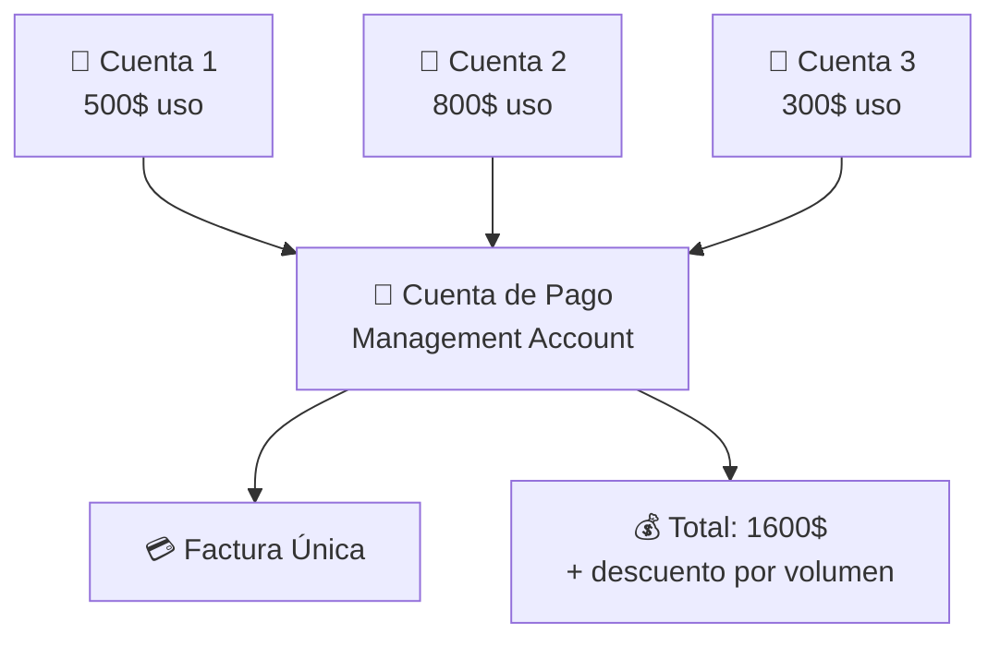

> ⚠️ **Importante**: La cuenta de facturación (management account) NO puede acceder a los recursos de las cuentas miembro, solo paga por ellas.

---

## 4.5 Estrategias de Optimización de Costes

### Instancias Correctamente Dimensionadas (Right-Sizing)
- Analizar instancias EC2 infra o sobre-utilizadas y ajustar al tamaño correcto.
- **AWS Compute Optimizer** ayuda con recomendaciones automáticas.

### Eliminar Recursos Sin Uso
- Snapshots de EBS antiguos, IPs elásticas no asociadas, instancias detenidas olvidadas.

### Instancias Reservadas y Savings Plans
- Para cargas predecibles, siempre comprar Reserved Instances o Savings Plans.
- Ahorro de hasta el 72%.

### Instancias Spot
- Para cargas tolerantes a interrupciones, usar Spot (ahorro hasta 90%).

### S3 Intelligent-Tiering
- Para datos con patrones de acceso impredecibles, deja que AWS gestione la clase automáticamente.

### Ciclos de Vida en S3
- Configura lifecycle policies para mover datos a clases más baratas automáticamente.

### AWS Trusted Advisor
- Analiza tu cuenta y da **recomendaciones** en 5 categorías:
  - 💰 **Optimización de costes** (ej: instancias ociosas)
  - 🔒 **Seguridad** (ej: MFA no activado)
  - 🔄 **Fiabilidad** (ej: sin backups)
  - ⚡ **Rendimiento** (ej: instancias con alto uso de CPU)
  - 📊 **Límites de servicio** (ej: cerca del límite de VPCs)

> ⚠️ **Para el examen**: Los checks completos de Trusted Advisor solo están disponibles con los planes de soporte **Business** y **Enterprise**.

---

## 4.6 Planes de Soporte AWS

AWS ofrece diferentes niveles de soporte. Esto suele aparecer en el examen.

```mermaid
graph TD
    S1[🆓 Basic<br/>Gratis] --> S2[👨‍💻 Developer<br/>Desde 29$/mes]
    S2 --> S3[🏢 Business<br/>Desde 100$/mes]
    S3 --> S4[🏦 Enterprise On-Ramp<br/>Desde 5.500$/mes]
    S4 --> S5[🌟 Enterprise<br/>Desde 15.000$/mes]
```

### Comparativa de Planes

| Característica | Basic | Developer | Business | Enterprise On-Ramp | Enterprise |
|----------------|-------|-----------|----------|--------------------|------------|
| **Precio** | Gratis | 29$/mes | 100$/mes | 5.500$/mes | 15.000$/mes |
| **Trusted Advisor** | Solo 7 checks | Solo 7 checks | Todos | Todos | Todos |
| **Soporte técnico** | No | Email (horario laboral) | 24/7 email, chat, teléfono | 24/7 | 24/7 |
| **SLA respuesta crítico** | No | No | < 1 hora | < 30 min | < 15 min |
| **Technical Account Manager (TAM)** | No | No | No | Pool de TAMs | TAM dedicado |
| **Concierge Support** | No | No | No | Sí | Sí |
| **Soporte 3rd party** | No | No | Sí | Sí | Sí |
| **Acceso a AWS Health API** | No | No | Sí | Sí | Sí |

> 🧠 **Para recordar los planes**: **B**asic · **D**eveloper · **B**usiness · **E**nterprise On-Ramp · **E**nterprise = **BDBEE**

> ⚠️ **Preguntas frecuentes en el examen**:
> - ¿Qué plan incluye TAM? → Enterprise (y Enterprise On-Ramp con pool)
> - ¿Qué plan tiene todos los checks de Trusted Advisor? → Business, Enterprise On-Ramp, Enterprise
> - ¿Qué plan da respuesta en menos de 1 hora para sistemas de producción caídos? → Business (mínimo)

### Technical Account Manager (TAM)
- Punto de contacto técnico **dedicado** de AWS para tu empresa.
- Te ayuda a optimizar el uso de AWS, planificar arquitecturas, resolver problemas.
- Solo disponible en planes Enterprise.

### AWS Support Center
- Portal web para **abrir casos de soporte** técnico.

### AWS Personal Health Dashboard
- Te avisa de **eventos de AWS que afectan específicamente a TU cuenta** (no solo estado general).

### AWS Service Health Dashboard
- Muestra el estado global de **todos los servicios AWS** en todas las regiones.
- Público en `status.aws.amazon.com`.

---

## 4.7 Otros Programas y Recursos

### AWS Marketplace
- **Tienda de software** de terceros que se ejecuta en AWS.
- Puedes comprar: AMIs pre-configuradas, SaaS, datos, soluciones de seguridad.
- Los cargos aparecen en tu factura de AWS (simplifica la gestión).

### AWS Partner Network (APN)
- Red de **socios tecnológicos y de consultoría** de AWS.
- Dos tipos:
  - **Technology Partners**: Empresas con software/servicios en AWS
  - **Consulting Partners**: Empresas que ayudan a los clientes a diseñar y migrar a AWS

### AWS IQ
- Plataforma para contratar **expertos certificados de AWS** para proyectos puntuales.

### AWS re:Post
- **Comunidad** de preguntas y respuestas técnicas sobre AWS (antes "AWS Forums").

### AWS Knowledge Center
- Artículos y respuestas a las **preguntas más frecuentes** de soporte técnico de AWS.

---

# 📝 RESUMEN RÁPIDO: Servicios por Categoría

## Mapa Mental de Servicios AWS

```mermaid
mindmap
  root((AWS Services))
    Computación
      EC2
      Lambda
      ECS/EKS
      Fargate
      Beanstalk
    Almacenamiento
      S3
      EBS
      EFS
      Glacier
    Bases de datos
      RDS/Aurora
      DynamoDB
      ElastiCache
      Redshift
    Redes
      VPC
      CloudFront
      Route 53
      Direct Connect
    Seguridad
      IAM
      KMS
      GuardDuty
      Shield/WAF
    Monitorización
      CloudWatch
      CloudTrail
      Config
      X-Ray
    Integración
      SQS
      SNS
      EventBridge
      Step Functions
    DevOps
      CodePipeline
      CloudFormation
      CDK
    IA/ML
      SageMaker
      Rekognition
      Bedrock
```

---

# 🎯 GUÍA DE ESTUDIO: Qué Esperar en el Examen

## Tipos de preguntas frecuentes

### Patrón 1: "¿Cuál es la RESPONSABILIDAD de AWS?"
- Infraestructura física, hardware, virtualización, red global → **AWS**
- SO de EC2, datos, configuración IAM, parches de aplicaciones → **Cliente**

### Patrón 2: "¿Qué servicio de seguridad usar?"
- Protección DDoS → **Shield**
- Filtrar peticiones web maliciosas → **WAF**
- Detectar amenazas con ML → **GuardDuty**
- Analizar vulnerabilidades de EC2 → **Inspector**
- Descubrir datos sensibles en S3 → **Macie**
- Gestionar claves de cifrado → **KMS**
- Auditoría de llamadas API → **CloudTrail**
- Estado de configuración → **Config**
- Informes de cumplimiento → **Artifact**

### Patrón 3: "¿Qué servicio de base de datos usar?"
- Base de datos relacional gestionada → **RDS**
- Base de datos relacional de alto rendimiento → **Aurora**
- NoSQL de baja latencia → **DynamoDB**
- Caché en memoria → **ElastiCache**
- Data Warehouse / Analytics → **Redshift**
- Base de datos de grafos → **Neptune**
- Documentos JSON (MongoDB compatible) → **DocumentDB**

### Patrón 4: "¿Cómo reducir costes?"
- Carga estable, predecible → **Reserved Instances / Savings Plans**
- Carga tolerante a interrupciones → **Spot Instances**
- Ajustar tamaño de instancias → **Compute Optimizer / Right-Sizing**
- Analizar gastos → **Cost Explorer**
- Alertas de gasto → **Budgets**

### Patrón 5: "¿Cómo mover datos a AWS?"
- Muchos datos, internet es lento → **Snow Family**
- Migración de base de datos → **DMS**
- Sincronización de archivos en línea → **DataSync**
- Acceso SFTP a S3/EFS → **Transfer Family**

### Patrón 6: "¿Cómo desacoplar arquitecturas?"
- Cola de mensajes (1 a 1) → **SQS**
- Notificaciones (1 a muchos) → **SNS**
- Eventos en tiempo real → **EventBridge**
- Flujos de trabajo → **Step Functions**

---

# 🃏 FLASH CARDS — Términos Clave

| Término | Definición rápida |
|---------|-------------------|
| **ARN** | Amazon Resource Name — identificador único de cualquier recurso AWS |
| **AZ** | Availability Zone — data center(s) físicamente separado dentro de una región |
| **CapEx** | Gasto de capital — compra de activos físicos (servidores) |
| **OpEx** | Gasto operativo — pago por uso (nube) |
| **HA** | High Availability — el sistema sigue funcionando aunque falle un componente |
| **Fault Tolerance** | Mayor que HA — el sistema sigue sin degradación aunque falle un componente |
| **RTO** | Recovery Time Objective — tiempo máximo para recuperarse de un fallo |
| **RPO** | Recovery Point Objective — máxima pérdida de datos aceptable en el tiempo |
| **SLA** | Service Level Agreement — acuerdo de nivel de servicio (uptime garantizado) |
| **TCO** | Total Cost of Ownership — coste total de poseer/operar infraestructura |
| **IaC** | Infrastructure as Code — infraestructura definida en código (CloudFormation) |
| **PII** | Personally Identifiable Information — datos que identifican a personas |
| **CIDR** | Classless Inter-Domain Routing — notación para rangos de IPs (ej: 10.0.0.0/16) |
| **NAT** | Network Address Translation — permite salida a internet desde red privada |
| **VPN** | Virtual Private Network — túnel cifrado sobre internet |
| **CDN** | Content Delivery Network — red de distribución de contenido (CloudFront) |
| **Serverless** | Sin gestión de servidores, pago por ejecución (Lambda, Fargate) |
| **Multi-AZ** | Recurso desplegado en múltiples AZs para alta disponibilidad |
| **OLTP** | Online Transaction Processing — BD transaccional (RDS) |
| **OLAP** | Online Analytical Processing — BD analítica (Redshift) |
| **ETL** | Extract, Transform, Load — proceso de integración de datos (Glue) |

---

# ✅ CHECKLIST FINAL ANTES DEL EXAMEN

## Conceptos que DEBES dominar:

- [ ] Modelo de responsabilidad compartida (qué gestiona AWS vs qué gestiono yo)
- [ ] Los 6 pilares del Well-Architected Framework
- [ ] Modelos de despliegue (público, privado, híbrido) y modelos de servicio (IaaS, PaaS, SaaS)
- [ ] IAM: usuarios, grupos, roles, políticas — diferencias y cuándo usar cada uno
- [ ] MFA y buenas prácticas de seguridad IAM
- [ ] Opciones de compra de EC2 (On-Demand, Reserved, Spot, Savings Plans)
- [ ] Clases de almacenamiento S3 y cuándo usar cada una
- [ ] VPC: subnets, Security Groups, NACLs, Internet Gateway, NAT Gateway
- [ ] RDS Multi-AZ vs Read Replicas
- [ ] Diferencias entre SQS y SNS
- [ ] CloudTrail vs CloudWatch vs Config (para qué sirve cada uno)
- [ ] Los servicios de seguridad: GuardDuty, Inspector, Macie, Shield, WAF
- [ ] AWS Organizations y facturación consolidada
- [ ] Planes de soporte: qué incluye cada uno (especialmente Business y Enterprise)
- [ ] Trusted Advisor: qué es y qué plan lo desbloquea
- [ ] Snow Family: cuándo usar Snowcone, Snowball, Snowmobile
- [ ] Herramientas de costes: Pricing Calculator, Cost Explorer, Budgets
- [ ] AWS Artifact: dónde encontrar informes de cumplimiento
- [ ] Diferencia entre Regiones y Availability Zones
- [ ] Qué es CloudFront y para qué sirven las Edge Locations

---

> 📌 **Consejo final**: El examen mide comprensión conceptual, no memorización de precios o comandos específicos. Entiende el propósito de cada servicio y en qué escenarios elegirías uno sobre otro. ¡Mucho ánimo, Carlos! 🚀